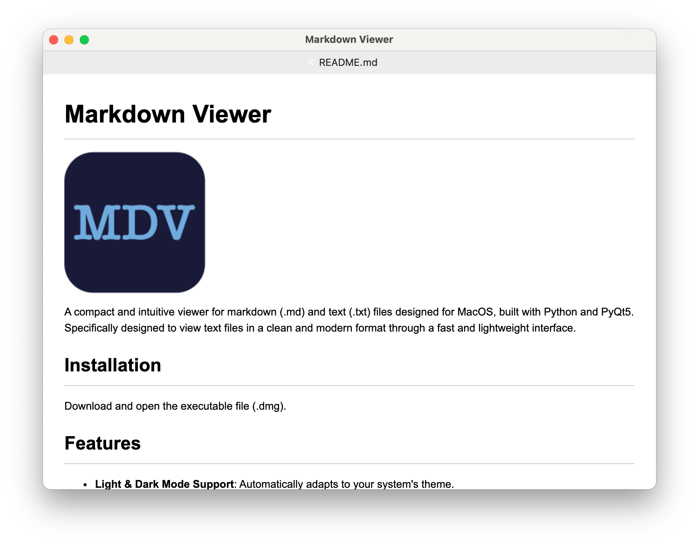

# Markdown Viewer

A compact and intuitive viewer for markdown (.md) and text (.txt) files designed for MacOS, built with Python and PyQt5. Specifically designed to view text files in a clean and modern format through a fast and lightweight interface.

  

## Installation

[Download here](https://drive.google.com/file/d/1wlY5Htb8ZlJni-9hEVYKZyJscPQAGM-y/view?usp=drive_link) the compressed installation disk image, unzip it and install.

## Features

- **Light & Dark Mode Support**: Automatically adapts to your system's theme.
- **Tabbed Interface**: Open multiple markdown files in separate tabs for easy navigation.
- **Keyboard Shortcuts**: Speed up your workflow with quick shortcuts for opening and closing files.
- **Custom Themes**: Comes with built-in light and dark themes to enhance the reading experience.
- **Powered by Mistune**: For accurate and fast markdown content interpretation.

## Usage

1. Use `Cmd + O` (or `Ctrl + O` on Windows/Linux) to open a  file in .md or .txt format.
2. Navigate between tabs using `Cmd + Shift + [` and `Cmd + Shift + ]` (or `Ctrl + Shift + [` and `Ctrl + Shift + ]` on Windows/Linux).
3. Close the  file or tab using `Cmd + W` (or `Ctrl + W` on Windows/Linux).

## Keyboard Shortcuts

- `Cmd + O`: Open a markdown file.
- `Cmd + W`: Close the current tab or markdown file.
- `Cmd + Shift + [`: Move to the previous tab.
- `Cmd + Shift + ]`: Move to the next tab.

## Contributing

Feel free to fork the repository and submit pull requests! We appreciate any contribution whether it's a bug fix, a new feature, or even a simple typo correction.

## Credits

© Alex Arroyo 2023